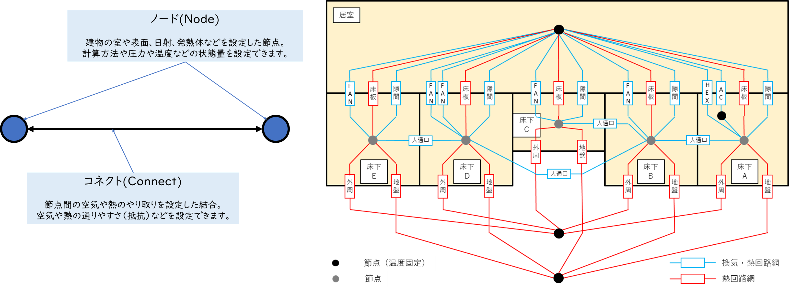
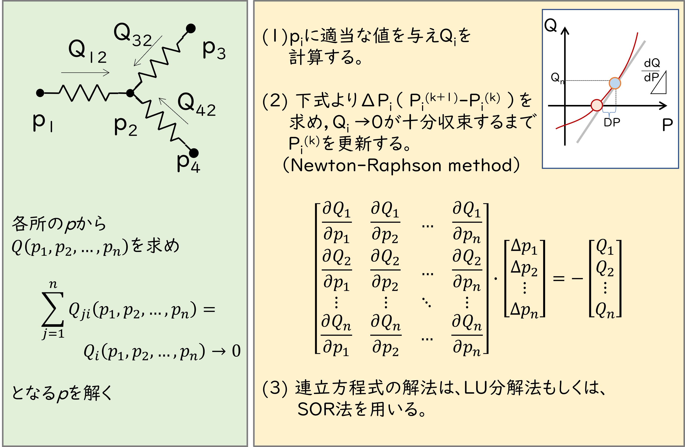

# 温熱計算プログラムvtsimの使い方

---
## 1.はじめに

  vtsimは、建築環境工学・建築設備を学ぶ大学生、研究者向けに開発された温熱計算プログラムで、下記の特徴があります。

*   ブラウザ上（Google Clab）で動作する。環境設定が不要。
*   自由度の高いプログラム言語pythonで記述。
*   計算 速度が求められる計算部分はc++で記述。
*   ユーザーは、プログラム言語pythonに加え、pythonのライブラリpandasなどの知識が必要。
*   熱・換気回路網による計算をベースとし、節点（ノード）と接続（コネクト）、各種条件の設定で動作。

---
## 2.インストール方法

  Google Colabで下記のコードを実行して、インストールします。

```
!pip install git+https://github.com/iguchi-lab/vtsim
from vtsim import vtsim as vt
```
  あわせて下記も実行しておくことを便利です。

  ※matplotlibは、グラフをの描画に必要。japanize-matplotlibで、日本語にも対応できます。

  ※numpyとpandasは、行列などを扱う際に必要です。

```
!pip install japanize-matplotlib
import matplotlib.pyplot as plt
import japanize_matplotlib

import numpy as np
import pandas as pd
```

---
## 3.vtsim関連モジュールの構成

  vtsimは、下記のモジュールで構成されます。

|モジュール名|簡略名（推奨）|内容|
|:--:|:--:|:--|
|vtsim.py|vt|vtsim本体の計算機能（vtsimのc++モジュールを動かす）|
|archenvlib.py|lib|各種物理定数の他、湿り空気、太陽位置、直散分離、快適性などを計算|
|fan_sts.py|fan|送風ファンのPQ特性|
|cof_ground.py|gnd|地盤の応答係数|
|material.py|mat|建築材料と壁面構成|

---
## 4.vtsimによる計算の基本的な考え方

ノードとコネクトの構成により、下記のような様々な計算が可能です。

- 換気回路網計算による、多数室、部位間の空気の移動
- 熱回路網計算による、多数室、部位間の温度や熱流
- 空気と共に移動する物質の室内濃度



---
## 5.計算の流れ

計算は下記の通り行われます。詳細は拡充していく予定。

#### ① ノードとコネクトの読み込みと、タイムステップの設定

  - ※vtsimでは、JSON方式もしくは、pythonの辞書型（dict）でデータを読み込みます。

#### ② 換気回路網計算で圧力、熱回路網計算で温度を計算。変化量が小さくなるまで繰り返す
  - ※絶対湿度の計算が設定されている場合は、水蒸気の移動も計算されます。

#### ③ 濃度計算により各節点の濃度を計算する


#### ④ 設定されたタイムステップの分だけ計算を繰り返す

  - 次のタイムステップでは、現在のタイムステップの状態を初期値として、新しい計算が行われます。
  - タイムステップは任意の時間間隔（一定である必要があります）で任意の長さを設定できます。

#### ⑤ 計算結果を出力する

  - 計算結果は、pd.DataFrame形式で出力される他、csvファイル、matplolibtによるグラフで出力されます。


  ※換気回路網計算、熱回路網計算および濃度計算は、計算の設定が無い場合はスキップされます。

---
## 6. 収束計算の方法

圧力と温度の収束計算は、下記の通り行います。連立方程式の解法には、LU分解法かSOR法が選択できます。



---
## 7. 入力方法 

vtsimでは、JSON方式もしくは、pythonの辞書型（dict）でデータを読み込みます。JSON方式もしくは、pythonの辞書型（dict）は、中括弧「 { } 」を使って記述され、引用符「 ' ' 」で囲まれたキー(key)と、コロン「 : 」の後に続く値(value)で記述されます。要素と要素の間は、カンマ「 , 」で区切ります。値(value)には定数、変数の他、リスト形式(pythonでは、各括弧「 [ ] 」で囲まれ、数字の羅列などを格納)の他辞書型、pd.Series型などを格納することができ、汎用性に富んでいます。また、記述方法がJSON形式とほぼ同じであるため互換性が高く、入力内容をJSON方式で記録して、やり取りすることが容易です。ただし、pythonの辞書型(dict)は、重複したキーを設定することができないため注意が必要です。

```
input = {
  'AAA': vvv,
  'BBB': [A, b, c, d]...
}
```


## 8. 計算条件の設定

### index

indexは、計算対象の時刻のリストで実際の日時が用いられます。indexからタイムステップと時間間隔が抽出されるため、入力が必須になっています。また、indexは、時刻を表す文字列のリスト形式でpd.to_datetimeで時刻として認識できることが必須条件です。 '2022/02/20 22:22:22' のように '%Y/%m/%d %H:%M:%S' 形式であると無難でしょう。エクセル等で作成されたcsvファイルでも、最も左にある列をこの方式で保存しておけばvtsimで読み込むことが可能です。vtsimでは、1番目と2番目の時刻から時間間隔を、indexの長さから計算するデータ長さを決定しています。

```
input = {
  'index': ['2022/02/20 22:22:22', '2022/02/20 22:22:23', ...]
}
```

### calc_sts

calc_stsでvtsimの計算条件を設定します。辞書型(dict)で以下の設定を行うことができます。

|設定項目|内容|設定値|省略時の設定|
|:--:|:--|:--:|:--:|
|solve|連立方程式の解法|LU分解法： 0 か vt.solve_LU<br>SOR法： 1 か vt.solve_SORを設定|LU分解法|
|step_p|換気回路網計算時の偏微分で傾きを求める際の、<br>圧力の微小変化量|数値|1e-6|
|vent_err|換気回路網計算時の許容残差|数値|1e-6|
|step_t|熱回路網計算時の偏微分で傾きを求める際の、<br>温度の微小変化量|数値|1e-6|
|thrm_err|換気回路網計算時の許容残差|数値|1e-6|
|conv_err|換気回路網、熱回路網計算後の<br>圧力と温度の収束判定に用いる許容変化量|数値|1e-6|
|sor_ratio|SOR法で連立方程式を解く際の、緩和係数|数値|0.9|
|sor_err|SOR法で連立方程式を解く際の、<br>収束判定に用いる許容残差|数値|1e-6|
```
input = {
  'calc_sts': {
    'solve':  vt.soive_LU,
    'step_p': 1e-3,
    ...
  }
}
```

### opt

optでvtsimの出力方法を設定します。
|設定項目|内容|設定値|省略時の設定|
|:--:|:--|:--:|:--:|
|opt|出力方法|pd.DataFrame のみの出力：0 または vt.OPT_DF<br>さらにcsvファイルを出力：1 または vt.OPT_CSV<br>さらにグラフを出力：2 または vt.OPT_GRAPH|vt.OPT_GRAPH|

```
input = {
  'opt': vt.OPT_GRAPH
}
```

# 9. ノードの設定

### sn

snでノード(sim_node)の設定を行います。ノードは、ノード名をキー(key)とした辞書型(dict)で設定します。値は数値（例えば、0.0や1.0など）もしくはリスト（[0.0, 1.0, ...]）で設定することができます。リストでの設定も可である値を数値で設定した場合、自動的にデータ長さ分のリストに変換され設定がされます。t_flagをvt.SN_DLYに設定してs_iに親ノード名を指定すると、親ノードの1ステップ前の温度を継承する特殊なノードを作成することができます。ノードにcapaを設定した場合、t_flagをvt.SN_DLY、親ノード名を自ノードとした子ノードが自動的に追加され、さらに自ノードと子ノードの間に熱容量に相当する熱コンダクタンスが設定されて、熱容量を再現します。

※ノード名中の「 」（空白）は無視されます。また、ノード名のうち「 : 」の後の文字は無視されます（メモ書きとして利用可能です）。

※ノード名の文字列は、「 , 」で区切ると、エラーが発生することがありますので推奨しません。

※SN_CALCに設定されているノードが計算対象でないと計算が発散します（ノードがSN_CALCに設定されているにもかかわらず、孤立している場合など）。

```
input = {
  'sn': {
    'nodeA': {
      't_flag': vt.SN_CALC
    }
    'nodeB : memo': {
      't_flag': vt.SN_FIX,
      't': 20.0
    }
  }
}
```

|設定項目|内容|値|省略時の設定|
|:--:|:--|:--|:--:|
|v_flag|換気回路網計算における圧力の計算|計算なし：0 か vt.SN_NONE<br>計算する：1 か vt.SN_CALC<br>固定値：2 か vt.SN_FIX|計算なし|
|t_flag|熱回路網計算における温度の計算|計算なし：0 か vt.SN_NONE<br>計算する：1 か vt.SN_CALC<br>固定値：2 か vt.SN_FIX<br>遅延：3 か vt.DLY|計算なし|
|c_flag|濃度計算における濃度の計算|計算なし：0 か vt.SN_NONE<br>計算する：1 か vt.SN_CALC<br>固定値：2 か vt.SN_FIX|計算なし|
|x_flag|換気回路における水蒸気移動の計算|計算なし：0 か vt.SN_NONE<br>計算する：1 か vt.SN_CALC<br>固定値：2 か vt.SN_FIX|計算なし|
|p|圧力 [Pa]|数値（リストでの設定も可）|0.0|
|t|温度 [℃]|数値（リストでの設定も可）|20.0|
|c|濃度 [個/m<sup>3</sup>]|数値（リストでの設定も可）|0.0|
|x|絶対湿度 [kg/kg(DA)]|数値（リストでの設定も可）|0.0|
|isolation|日射量 [W/m<sup>2</sup>]|数値（リストでの設定も可）|なし|
|h_input|発熱量 [W]|数値（リストでの設定も可）|なし|
|v|気積 [m<sup>3</sup>] （濃度計算用）|数値（リストでの設定も可）|なし|
|m|粉塵発生量 [個/s]|数値（リストでの設定も可）|なし|
|beta|沈着係数 [1/s]|数値（リストでの設定も可）|なし|
|s_i|親ノードのノード名|ノード名の文字列|なし|
|capa|熱容量 [J/K]|数値（リストでの設定も可）|なし|

# 10. 換気回路網の設定

### vn

vnで換気回路網の設定を行います。換気回路網は、「->」を挟んで始点と終点のノード名を記述（例えば「node1 -> node2」）したキー(key)とした辞書型(dict)で設定します。値(value)は数値（例えば、0.0や1.0など）もしくはリスト（[0.0, 1.0, ...]）で設定することができます。リストでの設定も可である値を数値で設定した場合、自動的にデータ長さ分のリストに変換され設定がされます。値(value)に記載された内容によって、自動的にどのような回路網が設定されたか判別されます。

※ネットワーク名中の「 」（空白）は無視されます。また、ネットワーク名のうち「 : 」の後の文字は無視されます（メモ書きとして利用可能です）。

※「node1 -> node2 -> node3」のような記述により、「node1 -> node2」と「node2 -> node3」に同じ値を設定することが可能です。

※ネットワーク名の文字列は、「 , 」で区切ることで、複数のネットワークに同じ値を設定することができます。

```
input = {
  'vn': {
    'nodeA -> nodeB, nodeA -> nodeC : memo': {
      'vol': 0.500
    }
    'node1 -> node2 -> node 3 : memo': {
      'vol': 5.777
    }
  }
}
```

### 共通
vnの設定では、共通して以下の項目の設定が必要です。
|設定項目|内容|値|省略時の設定|
|:--:|:--|:--|:--:|
|h1|始点の高さ [m]|数値（リストでの設定も可）|0.0|
|h2|終点の高さ [m]|数値（リストでの設定も可）|0.0|
|eta|除去効率（濃度計算用） [-]|数値（リストでの設定も可）|なし|

### 単純開口 vt.VT_SIMPLE
alphaとareaが設定されている場合、単純開口の認識されます。
|設定項目|内容|値|
|:--:|:--|:--|
|alpha|流量計数 [-]|数値（リストでの設定も可）|
|area|面積 [m<sup>2</sup>]|数値（リストでの設定も可）|

### 隙間 vt.VT_GAP
aとnが設定されている場合、隙間と認識されます。
|設定項目|内容|値|
|:--:|:--|:--|
|a|通気率 [-]|数値（リストでの設定も可）|
|n|隙間特性値 [-]|数値（リストでの設定も可）|

### 固定風量 vt.VT_FIX
volが設定されている場合、固定風量と認識されます。
|設定項目|内容|値|
|:--:|:--|:--|
|vol|送風量 [m<sup>3</sup>/s]|数値（リストでの設定も可）|

### エアコン vt.VT_AIRCON
ac_volが設定されている場合、エアコンと認識されます。エアコンは、換気回路網上は固定風量と変わりませんが、空気の移動に伴う熱流は0とする特殊ネットワークです。熱回路網にもエアコンを設定することによって、エアコンを再現することができます。
|設定項目|内容|値|
|:--:|:--|:--|
|ac_vol|送風量 [m<sup>3</sup>/s]|数値（リストでの設定も可）|

### 送風ファン vt.VT_FAN
qmaxとpmaxが設定されている場合、送風ファンと認識されます。設定される送風ファンは、(0, qmax)、(p1, q1)および(pmax, 0)の3点を通るPQ特性となります。
|設定項目|内容|値|
|:--:|:--|:--|
|qmax|圧力損失最大値 [Pa]|数値（リストでの設定も可）|
|pmax|風量最大値 [m<sup>3</sup>/s]||数値（リストでの設定も可）|
|q1|ある点の圧力損失 [Pa]|数値（リストでの設定も可）|
|p1|ある点の風量 [m<sup>3</sup>/s]|数値（リストでの設定も可）|

# 11. 熱回路網の設定

### tn

tnで熱回路網の設定を行います。熱回路網は、「->」を挟んで始点と終点のノード名を記述（例えば「node1 -> node2」）したキー(key)とした辞書型(dict)で設定します。値(value)は数値（例えば、0.0や1.0など）もしくはリスト（[0.0, 1.0, ...]）で設定することができます。リストでの設定も可である値を数値で設定した場合、自動的にデータ長さ分のリストに変換され設定がされます。値(value)に記載された内容によって、自動的にどのような回路網が設定されたか判別されます。

※ネットワーク名中の「 」（空白）は無視されます。また、ネットワーク名のうち「 : 」の後の文字は無視されます（メモ書きとして利用可能です）。

※ネットワーク名の文字列は、「 , 」で区切ることで、複数のネットワークに同じ値を設定することができます。

```
input = {
  'tn': {
    'nodeA -> nodeB, nodeA -> nodeC : memo': {
      'cdtc': 0.500
    }
  }
}
```

### 単純熱回路 vt.TN_SIMPLE
cdtcが設定されている場合、単純熱回路と認識されます。貫流、放射などの熱流は全て単純熱回路で表現されます。熱コンダクタンスは、熱抵抗の逆数、熱貫流率に面積を乗じた値となります。
|設定項目|内容|値|
|:--:|:--|:--|
|cdtc|熱コンダクタンス [W/(m<sup>2</sup>･K)]|数値（リストでの設定も可）|

### 地盤の吸熱応答 vt.TN_GROUND
cof_rとphi_0が設定されている場合、地盤の吸熱応答と認識されます。
|設定項目|内容|値|
|:--:|:--|:--|
|area|面積 [m<sup>2</sup>]|数値（リストでの設定も可）|
|cof_r|公比 [-]|数値（リストでの設定はできない）|
|phi_0|吸熱応答係数の初項 [-]|数値（リストでの設定はできない）|
|cof_phi|吸熱応答係数 [-]|リストでの設定（計算期間中一定）|

### 日射熱取得 vt.TN_SOLAR
msが設定されている場合、日射熱取得と認識されます。単位日射強度当たりの日射熱取得量は、日射熱取得率に面積を乗じた値になります。
|設定項目|内容|値|
|:--:|:--|:--|
|ms|単位日射強度当たりの日射熱取得量 [W/(W/m<sup>2</sup>)]|数値（リストでの設定も可）|

### エアコン vt.TN_AIRCON
ac_modeとpre_tmpが設定されている場合、エアコンと認識されます。エアコンは、節点の熱収支を計算する際に、始点の熱収支をQsを0とし、終点の熱収支に-Qsを加える特殊ノードです。換気回路網のエアコンとセットで用いる必要があります。ac_modeはエアコンの運転モード、pre_tmpは設定温度です。
|設定項目|内容|値|
|:--:|:--|:--|
|ac_mode|エアコンの運転モード|自動（暖冷房で設定温度を維持）：0 または vt.AC_AUTO<br>暖房：1 または vt.AC_HEATING<br>冷房：2 または vt.AC_COOLING<br>停止：3 または vt.AC_STOP|
|pre_tmp|設定温度 [℃]|数値（リストでの設定も可）|

### ヒーター vt.TN_HEATER
何も設定が無い場合は、ヒーターと認識されます。終点のノードのh_inputに記載された熱量が毎回始点ノードに加算されます。


# 12. 外界条件の設定

vtsimは、前章までの設定であらゆる計算が可能ですが、計算の実行には多数の設定が必要であり、効率的かつ統一的なノードやネットワークの設定のため、設定を支援する方法があります。外界条件の設定方法は、まだ十分整理されていない点があり、随時変更の予定です。

### wind_pressure

風向と風速が記述された気象データを用いて、外部風による風圧係数をもつノードを作成するための設定です。圧力を固定した方位別の外部節点（外部E、外部S、外部W、外部N、外部H）を作成し、圧力に、lib.make_windによって生成される、外部風圧係数を入力します。外部風圧係数の計算方法は、lib.make_windの説明を参照してください。

```
wind_pressure = lib.make_wind(df['wind_direction'], df['wind_speed'], c_in = 0.7, c_out = -0.5, c_horizontal = -0.9)

input = {
  'wind_pressure': wind_pressure
}
```

### outside_temp

方位を考慮しない外部節点（外部）、地盤中の不易層の節点（地盤）、もしくは、方位別の外部節点（外部E、外部S、外部W、外部N、外部H）に対し、ノードに温度固定と温度tを設定（{'t_flag': vt.SN_FIX, 't': t}）します。キーが「外部」、「地盤」、「外部E～H」でない場合は温度は設定されません。

```
input = {
  'outside_temp': {
    '外部': 20.0,
    '地盤': 15.0
  }
}
```

### solar

方位を考慮しない日射節点（日射_全天_H）、方位別（壁用およびガラス用）の日射節点（日射_壁_E～H, 日射_ガラス_E～H）を作成し、lib.make_solarによって生成される日射量（isolation）を設定します。水平面全天日射量、もしくは法線面直達日射量と拡散日射量などの気象データから、水平面全天日射量に単位日射強度当たりの日射熱取得量を乗じた計算、法線面直達日射量と拡散日射量を用いた方位別の計算が可能です。日射量の計算法は、lib.make_solarの説明を参照してください。

```
df, solar = lib.make_solar(s_ib = df_i['Ib'], s_id = df_i['Id'], lat = 36.00, lon = 140.00, td = -0.5)

input = {
  'solar': solar
}
```

### nocturnal

水平面（夜間_H）、鉛直面（夜間_V）の夜間放射節点を作成し、lib.make_nocturalによって生成される夜間放射量を設定します。夜間放射量は、気象データの温湿度から計算することが可能です。夜間放射量の計算法は、lib.make_nocturalの説明を参照してください。

```
df, noctural = lib.make_nocturnal(t = t, h = h)

input = {
  'noctural': noctural
}
```

# 13. 壁、ガラス、室内の設定

### wall

以下の表に従いwallを設定すると、始点のノード名「node1」に対し、内側表面（node1_is_w）と外側表面（node1_os_w）の二つのノードを追加し、終点ノード「node2」に向けた「node1 -> node1_is_w」、「node1_is_w -> node1_os_w」および「node_1_os_w -> node2」の単純熱回路を設定します。さらに、capa_wが設定されている場合は、内側表面と外側表面に子ノードが追加され、熱容量が設定されます。なお、複数の壁面があることを想定し、「 : 」以降に記述された内容が[( )]で付記されます。方角ごとに整理することを想定しています。また、solarを設定することにより、外側表面のノードに日射熱取得を、nocturnalを設定することにより、外側表面ノードに夜間放射を設定します。なお、熱伝達率を適切に設定し、日射量を設定しなければ室内の間仕切り壁の設定も可能です。

|設定項目|内容|値|省略時の設定|
|:--:|:--|:--|:--:|
|area|面積 [m<sup>2</sup>]|数値（リストでの設定も可）|なし|
|alpha_1|内側熱伝達率 [W/(m<sup>2</sup>･K)]|数値（リストでの設定も可）|9.0|
|alpha_2|外側熱伝達率 [W/(m<sup>2</sup>･K)]|数値（リストでの設定も可）|25.0|
|U_w|壁面のU値[W/(m<sup>2</sup>･K)]|数値（リストでの設定も可）|なし|
|capa_w|熱容量[J/(m<sup>2</sup>K)]|数値（リストでの設定も可）|なし|
|solar|日射ノード名|ノード名の文字列|なし|
|eta_w|日射取得率 [-]|数値（リストでの設定も可）|なし|
|nocturnal|夜間放射ノード名|ノード名の文字列|なし|
|epsilon_w|放射率 [-]|数値（リストでの設定も可）|なし|

### glass

以下の表に従いglassを設定すると、wallと同様に始点のノード名「node1」に対し、内側表面（node1_is_w）と外側表面（node1_os_w）の二つのノードを追加し、終点ノード「node2」に向けた「node1 -> node1_is_w」、「node1_is_w -> node1_os_w」および「node_1_os_w -> node2」の単純熱回路を設定します。なお、複数の壁面があることを想定し、「 : 」以降に記述された内容が[( )]で付記されます。方角ごとに整理することを想定しています。また、solarを設定することにより、壁面と異なり始点ノードに日射熱取得を、nocturanalを設定することにより、外側表面ノードに夜間放射を設定します。

|設定項目|内容|値|省略時の設定|
|:--:|:--|:--|:--:|
|area|面積 [m<sup>2</sup>]|数値（リストでの設定も可）|なし|
|alpha_1|内側熱伝達率 [W/(m<sup>2</sup>･K)]|数値（リストでの設定も可）|9.0|
|alpha_2|外側熱伝達率 [W/(m<sup>2</sup>･K)]|数値（リストでの設定も可）|25.0|
|U_w|壁面のU値[W/(m<sup>2</sup>･K)]|数値（リストでの設定も可）|なし|
|solar|日射ノード名|ノード名の文字列|なし|
|eta_w|日射取得率 [-]|数値（リストでの設定も可）|なし|
|nocturnal|夜間放射ノード名|ノード名の文字列|なし|
|epsilon_w|放射率 [-]|数値（リストでの設定も可）|なし|

### ground
以下の表に従い、groundを設定すると、始点のノード名「node1」に対し、内側表面(node1_is_w)が追加され、「node1 -> node1_is_w」の単純熱回路と「node1_is_w -> 地盤」の地盤熱回路が追加されます。

|設定項目|内容|値|省略時の設定|
|:--:|:--|:--|:--:|
|area|面積 [m<sup>2</sup>]|数値（リストでの設定も可）|なし|
|rg|熱抵抗[m<sup>2</sup>･K/W]|数値（リストでの設定も可）|不可|
|cof_r|公比 [-]|数値（リストでの設定はできない）|
|phi_0|吸熱応答係数の初項 [-]|数値（リストでの設定はできない）|
|cof_phi|吸熱応答係数 [-]|リストでの設定（計算期間中一定）|

### room
wallとglassの設定以外にroomを設定する方法があります。roomを設定することにより室ごとにまとめた設定ができる他、内側表面間の放射熱伝達回路を自動で作成します。その際、形態係数は、当該面積を全表面積を除した値になります。

|設定項目|内容|値|省略時の設定|
|:--:|:--|:--|:--:|
|wall|壁面設定に必要な項目|wallと同様|なし|
|glass|ガラス面設定に必要な項目|glassと同様|なし|
|ground|地盤面設定に必要な項目|groundと同様|なし|

# 14. 機器の設定

### aircon
airconの名称をキーとした以下の設定により、自動的にエアコンを設定することが可能です。エアコン名「AC」の場合、「AC_in」と「AC_out」のノードが追加され、換気回路網には、inと「AC_in」、「AC_in」と「AC_out」、「AC_out」とoutを接続する回路が設定され、熱回路網には、setとoutを接続するエアコン回路が設定されます。inとoutを省略もしくはsetと同じノード名を設定することで、setのノードの温度制御が可能です。inとout、setを設定することにより、他室の温度制御など、自由に設定が可能です。また、エアコンモデルの設定によって、消費電力の計算を行うことが可能です。エアコンモデルによっては、熱量を全て処理することが困難な場合、一部の熱量のみが処理されます。

|設定項目|内容|値|省略時の設定|
|:--:|:--|:--:|:--:|
|set|温度制御を行うノード名|ノード名の文字列|なし|
|in|吸込口側のノード名|ノード名の文字列|setのノード名|
|out|吹出側のノード名|ノード名の文字列|setのノード名|
|vol|送風量 [m<sup>3</sup>/s]|数値（リストでの設定も可）|1,000|
|ac_model|エアコンモデル|なし（顕熱負荷のみを計算）:0 または vt.AC_NONE<br>RACモデル：1 または vt.AC_RAC<br>DUCT_CENTRALモデル：2 または vt.AC_DUCT_C<br>RAC2モデル（将来用）：2 または vt.RAC2<br>電中研モデル（将来用）：3 または vr.CRIEPI|vt.AC_NONE<br>確認中|
|ac_mode|エアコンの運転モード|自動（暖冷房で設定温度を維持）：0 または vt.AC_AUTO<br>暖房：1 または vt.AC_HEATING<br>冷房：2 または vt.AC_COOLING<br>停止：3 または vt.AC_STOP|なし|
|pre_tmp|設定温度 [℃]|数値（リストでの設定も可）|
|pre_x|設定絶対湿度 [kg\kg(DA)]|数値（リストでの設定も可）|なし<br>※vt.AC_RACかvt.AC_DUCT_Cでは入力が必須ですが、現状では無視されます。|
|q_rtd_C|定格冷房能力 [W]|数値（リスト不可）|なし<br>vt.AC_RACでのみ必須|
|q_max_C|最大冷房能力 [W]|数値（リスト不可）|なし<br>vt.AC_RACでのみ必須|
|e_rtd_C|定格冷房エネルギー消費効率 [-]|数値（リスト不可）|なし<br>vt.AC_RACでのみ必須|
|q_rtd_H|定格暖房能力 [W]|数値（リスト不可）|なし<br>vt.AC_RACでのみ必須|
|q_max_H|最大暖房能力 [W]|数値（リスト不可）|なし<br>vt.AC_RACでのみ必須|
|e_rtd_H|定格暖房エネルギー消費効率 [-]|数値（リスト不可）|なし<br>vt.AC_RACでのみ必須|
|dualcompressor|デュアルコンプレッサーあり／なし|bool型 0: False、1: True|なし<br>vt.AC_RACでのみ必須|
|q_hs_rtd_H|熱源機の定格暖房能力 [W]|数値（リスト不可）|なし<br>vt.AC_DUCT_Cでのみ必須|
|q_hs_mid_H|熱源機の中間暖房能力 [W]|数値（リスト不可）|なし<br>vt.AC_DUCT_Cでのみ必須|
|q_hs_min_H|熱源機の最小暖房能力 [W]|数値（リスト不可）|なし<br>vt.AC_DUCT_Cでのみ必須|
|P_hs_rtd_H|熱源機の定格暖房消費電力 [W]|数値（リスト不可）|なし<br>vt.AC_DUCT_Cでのみ必須|
|V_fan_rtd_H|定格暖房能力運転時の送風機の風量 [m<sup>3</sup>/s]|数値（リスト不可）|なし<br>vt.AC_DUCT_Cでのみ必須<br>単位要注意|
|V_fan_mid_H|中間暖房能力運転時の送風機の風量 [m<sup>3</sup>/s]|数値（リスト不可）|なし<br>vt.AC_DUCT_Cでのみ必須<br>単位要注意|
|P_fan_rtd_H|定格暖房能力運転時の送風機の消費電力 [W]|数値（リスト不可）|なし<br>vt.AC_DUCT_Cでのみ必須|
|P_fan_mid_H|中間暖房能力運転時の送風機の消費電力 [W]|数値（リスト不可）|なし<br>vt.AC_DUCT_Cでのみ必須|
|V_hs_dsgn_H|暖房時の送風機の設計風量  [m<sup>3</sup>/s]|数値（リスト不可）|なし<br>vt.AC_DUCT_Cでのみ必須<br>単位要注意|
|q_hs_rtd_C|熱源機の定格冷房能力 [W]|数値（リスト不可）|なし<br>vt.AC_DUCT_Cでのみ必須|
|q_hs_mid_C|熱源機の中間冷房能力 [W]|数値（リスト不可）|なし<br>vt.AC_DUCT_Cでのみ必須|
|q_hs_min_C|熱源機の最小冷房能力 [W]|数値（リスト不可）|なし<br>vt.AC_DUCT_Cでのみ必須|
|P_hs_rtd_C|熱源機の定格冷房消費電力 [W]|数値（リスト不可）|なし<br>vt.AC_DUCT_Cでのみ必須|
|V_fan_rtd_C|定格冷房能力運転時の送風機の風量 [m<sup>3</sup>/s]|数値（リスト不可）|なし<br>vt.AC_DUCT_Cでのみ必須<br>単位要注意|
|V_fan_mid_C|中間冷房能力運転時の送風機の風量 [m<sup>3</sup>/s]|数値（リスト不可）|なし<br>vt.AC_DUCT_Cでのみ必須<br>単位要注意|
|P_fan_rtd_C|定格冷房能力運転時の送風機の消費電力 [W]|数値（リスト不可）|なし<br>vt.AC_DUCT_Cでのみ必須|
|P_fan_mid_C|中間冷房能力運転時の送風機の消費電力 [W]|数値（リスト不可）|なし<br>vt.AC_DUCT_Cでのみ必須|
|V_hs_dsgn_C|冷房時の送風機の設計風量  [m<sup>3</sup>/s]|数値（リスト不可）|なし<br>vt.AC_DUCT_Cでのみ必須<br>単位要注意|
|To|外気温度 [℃]|数値（リストでの設定も可）|なし<br>vt.AC_RACとvt.DUCT_Cで必須|
|ho|外気相対湿度 [%]|数値（リストでの設定も可）|なし<br>vt.AC_RACとvt.DUCT_Cで必須|

### heater
heaterの名称をキーとした以下の設定により、自動的にヒーターを設定することが可能です。ヒーターのノードが設定され、setで指定されたノードと接続されます。

|設定項目|内容|値|省略時の設定|
|:--:|:--|:--:|:--:|
|set|温度制御を行うノード名|ノード名の文字列|なし|
|output|出力 [W]|数値（リストでの設定も可）|なし|

### dust source
dust sourceの名称をキーとした以下の設定により、発塵源の設定が可能です。

|設定項目|内容|値|省略時の設定|
|:--:|:--|:--:|:--:|
|set|発塵のあるノード名|ノード名の文字列|なし|
|m|発塵量 [個/s]|数値（リストでの設定も可）|なし|

### air_cleaner
air_cleanerの名称をキーとした以下の設定により、空気清浄機の設定が可能です。

|設定項目|内容|値|省略時の設定|
|:--:|:--|:--:|:--:|
|set|集塵する換気回路網の名|ネットワーク名の文字列|なし|
|eta|除去効率 [-]|数値（リストでの設定も可）|なし|


# 14. ライブラリ内のツール

以下のツールが利用できる。詳細は、拡充していく予定。

- vt.read_csv(filename)
  - ファイル名filenameのcsvファイルを読み込みpd.DataFrameを返す。空欄は、自動で補完（後ろの値で補完した後、前の値で補完）、indexは自動的に時刻認識を行う。

- vt.index(freq, length)
  - freq('1s'、'1h'など)で設定された、ながさlengthのindexを作成する。はじめの時刻は、2021/1/1 00:00:00となる。

- vt.read_json(filename)
  - ファイル名filenameのjsonファイルを読み込みinputを返す。時刻は自動認識。

- vt.read_hasp(filename)
  - ファイル名filenameのhasp形式の気象データを読み込んで、pd.DataFrameを返す。

- vt.write_json(input, filename)
  - inputをファイル名filenameのjsonファイルに書き出す。

- vt.to_json(input)
  - inputをjson形式に変換する。

- vt.run_calc(input)
  - 計算を実行する。


- lib.make_wind(d, s, c_in = 0.7, c_out = -0.55, c_horizontal = -0.90)
  - 方位別の風圧係数を作成

- lib.make_solar(**kwargs)
  - 直散分離、方位別、壁、ガラス別の日射量を作成

- lib.make_nocturnal(t, h)
  - 夜間放射を作成

- fan
  - 送風ファンのPQ特性を格納

- gnd
  - 地盤の吸熱応答係数

- mat
  - 建築材料、壁面構成

# 15. チュートリアル

### インストール（使いそうなライブラリも含む）
```
!pip install git+https://github.com/iguchi-lab/vtsim
from vtsim import vtsim as vt

!pip install japanize-matplotlib
import matplotlib.pyplot as plt
import japanize_matplotlib

import numpy as np
import pandas as pd
```

### ２室の温度に関する計算例
```
input = {
    'index': vt.index('1s', 1),
    'solar':{
        '日射_全天_H': 400.0
    },
    'sn': {
        'Supply, Room1, Room2, Return':  {'t_flag': vt.SN_CALC},
        'Outside':                       {'t_flag': vt.SN_FIX, 't':  0.0}
    },
    'vn': {
        'Supply -> Room1 -> Return': {'vol': 500 / 3600},
        'Supply -> Room2 -> Return': {'vol': 500 / 3600}
    },
    'tn': {
        'Room1 -> Outside':       {'cdtc': 100 * 0.87},
        'Room2 -> Outside':       {'cdtc': 200 * 0.87},
        'Room2 -> 日射_全天_H':   {'ms': 1.0},
    },
    'aircon': {
        'AC-01': {'out': 'Supply', 'set': 'Return', 
                  'ac_mode': vt.AC_HEATING, 'vol': 1000 / 3600, 'pre_tmp': 20.0},
        'AC-02': {'set': 'Room2', 'ac_mode': vt.AC_HEATING, 'pre_tmp': 20.0},
    },
    'heater': {
        'heater-01':          {'output': 500.0, 'set': 'Room1'}
    }
}

vt.run_calc(input)
```

### 粉塵に関する計算例
```
df_i = pd.DataFrame(index = vt.index('10s', 7200))
df_i['m'] = 0
df_i['k'] = 0
df_i.loc['2021-01-01 00:10:00' : '2021-01-01 00:29:50', 'm'] = 28470

beta = 1e-5       

input = {
    'index': df_i.index,
    'sn': {
        '外部':       {'c_flag': vt.SN_FIX,  'c': 0.0},
        '空調室':     {'c_flag': vt.SN_CALC, 'c': 0.0, 'v':  13.66, 'beta': beta},
        '建築ダクト': {'c_flag': vt.SN_CALC, 'c': 0.0, 'v':   6.00, 'beta': beta},
        '寝室':       {'c_flag': vt.SN_CALC, 'c': 0.0, 'v':  40.25, 'beta': beta},
        '子供部屋':   {'c_flag': vt.SN_CALC, 'c': 0.0, 'v': 126.49, 'beta': beta},
        '和室':       {'c_flag': vt.SN_CALC, 'c': 0.0, 'v':  16.56, 'beta': beta},
        '洗面所':     {'c_flag': vt.SN_CALC, 'c': 0.0, 'v':   9.94, 'beta': beta},
        '吹抜':       {'c_flag': vt.SN_CALC, 'c': 0.0, 'v': 100.46, 'beta': beta}
    },
    'vn': {
        '空調室 -> 建築ダクト':                     {'vol': 1206 / 3600},
        '建築ダクト ->寝室 -> 吹抜 -> 空調室':      {'vol':  155 / 3600},
        '建築ダクト -> 子供部屋 -> 吹抜 -> 空調室': {'vol':  313 / 3600},
        '建築ダクト -> 和室 -> 吹抜 -> 空調室':     {'vol':  108 / 3600},
        '建築ダクト -> 洗面所 -> 吹抜 ->空調室':    {'vol':  176 / 3600},
        '建築ダクト -> 吹抜 -> 空調室':             {'vol':  454 / 3600},
    },
    'dust_source':{
        'ds1': {'m': df_i['m'], 'set': '吹抜'}
    },
    'air_cleaner':{
        'ac1': {'eta': df_i['k'], 'set': '空調室 -> 建築ダクト'}
    }
}

vt.run_calc(input)
```
